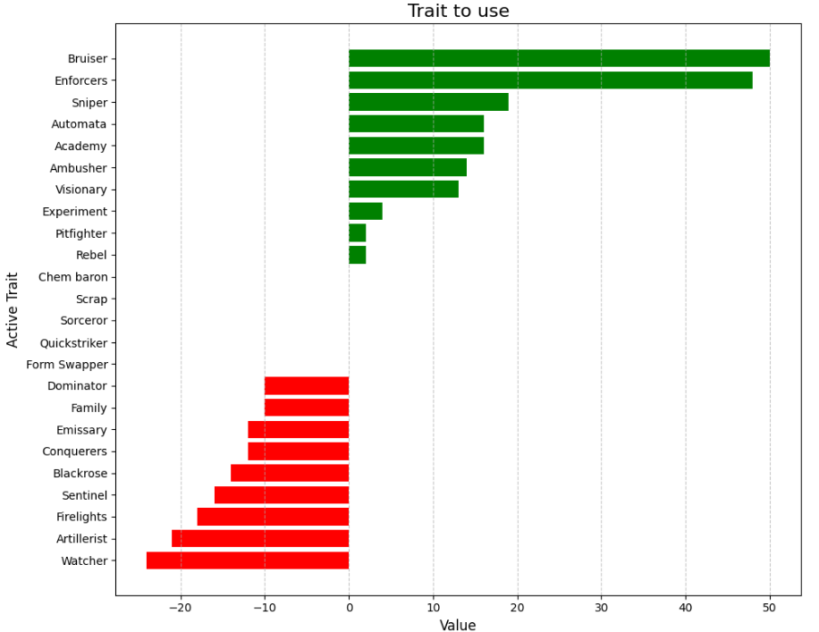

# TftTraitTracking
Utilizing the riot api, pandas, and matplotlib to track and graph which traits are best to use for a player to win. 

By taking the Username and Tagline, I made calls to the riot dev api to get the player unique ID (Puuid), matchID, and match stats. 

Then I weighed placement values with trait level to determine whether the player should use the trait or not 

Then I put this data into a dataFrame table and then graphed it using matplotlib

